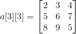

Q1. WAP to input an array of numbers and sort them in ascending order and
    display the sorted array.

# 2-D Array
## Example


```c
int arr[3][3];

arr[0][0] = 2;
arr[0][1] = 3;
arr[0][2] = 4;
arr[1][0] = 5;
arr[1][1] = 6;
arr[1][2] = 7;
arr[2][0] = 8;
arr[2][1] = 9;
arr[2][2] = 5;
```
OR
```c
int arr[3][3] = {{ 2, 3, 4 },
                 { 5, 6, 7 },
                 { 8, 9, 5 }};
```

## Inputting
```c
int a[10][10], m, n;

printf("Enter number of rows and columns separated by space");
scanf("%d %d", &m, &n);

for (int i=0; i<m; i++)
    for (int j=0; j<n; j++)
        scanf("%d", &a[i][j]);
```

## Outputting as a matrix
```c
for (int i=0; i<m; i++) {
    for (int j=0; j<n; j++)
        printf("%d ", a[i][j]);
    printf("\n");
}
```

Q2. Create a 2D array and print it in the matrix format.

Q3. Write a program to add two matrices.
